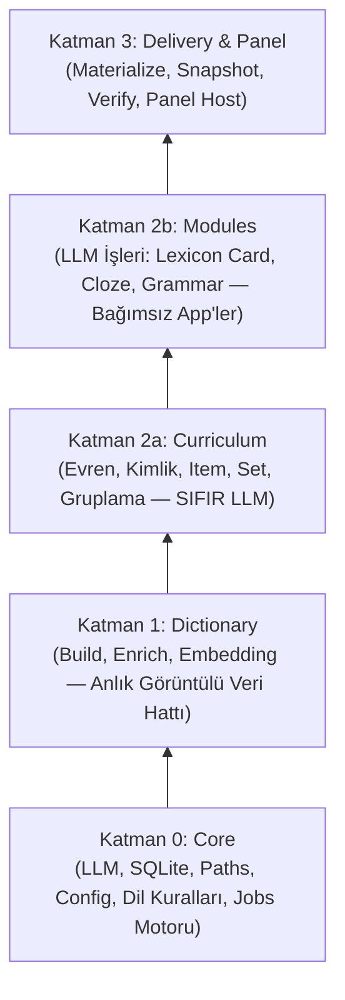

# Polyvo Word Databases

<div align="center">

# 📚 Polyvo Word Databases
### Multi-Source English Lexicon & Pedagogical Content Generation Pipeline

[](https://www.python.org/)
[](https://www.sqlite.org/)
[](https://creativecommons.org/licenses/by-sa/4.0/)
[](#-mimari--4-katman-tek-yönlü-bağımlılık)
[](#-test-ve-doğrulama)

<p align="center">
  <strong>Açık lisanslı İngilizce sözlük verilerini derleyip; anlamsal kümeleme, müfredat seçimi, LLM tabanlı anlam kartı, cloze testi, dil bilgisi analizi ve ana dil çevirisiyle eksiksiz dil öğrenme veritabanlarına dönüştüren modüler üretim hattı.</strong>
</p>

[Öne Çıkan Özellikler](#-öne-çıkan-özellikler) •
[Mimari](#-mimari--4-katman-tek-yönlü-bağımlılık) •
[Veri Ayrımı](#-iki-sınıf-veri-ve-neden-ayrı-duruyorlar) •
[Kurulum](#-hızlı-kurulum) •
[Komutlar (polyvo)](#-komut-rehberi-polyvo-cli) •
[Modüller](#-modüller-ve-işlevleri) •
[Web Paneli](#-web-yönetim-paneli) •
[Lisans](#-lisans)

---

</div>

## 🌟 Öne Çıkan Özellikler

- **🏛️ 4 Katmanlı Temiz Mimari** — Alt katmanın üst katmanı import edemediği (`test_layering.py`), tek yönlü bağımlılıkla tasarlanmış sağlam altyapı.
- **⚡ Otomatik Keşfedilen App Yapısı** — `polyvo apps` ile sistemdeki tüm modüller (`dictionary`, `curriculum`, `lexicon-card`, `cloze`, `grammar`, `delivery`, `review`) dinamik olarak taranır.
- **🛡️ Tier-0 İnsan Emeği Koruması** — İnsan düzeltmeleri `tier=0` olarak işaretlenir; hiçbir yapay zeka veya toplu işlem bu kayıtların üzerine yazamaz.
- **🔄 Sıfır-LLM İzdüşüm ve Sevkiyat** — Pahalı LLM kararları kimlik bazlı SQLite depolarında tutulur. Sevkiyat dosyalarının (`core.db`, `<l2>.db`, `i18n_<l1>.db`) üretimi sıfır dış çağrıyla, tamamen deterministiktir.
- **🎯 Çoklu Model Desteği ve Akıllı Fallback** — Yerel [Ollama](https://ollama.com) (Qwen), Colab GPU tüneli, Google [Gemini](https://ai.google.dev/), [OpenAI](https://openai.com/), [DeepSeek](https://www.deepseek.com/) ve [Cloudflare Workers AI](https://developers.cloudflare.com/workers-ai/) entegrasyonu.
- **🖥️ Modüler Web Paneli** — Her app kendi panel görünümünü (`APP.panel`) sunar. Tek komutla (`polyvo panel serve`) yerel web arayüzü başlar.

---

## 🏗️ Mimari — 4 Katman, Tek Yönlü Bağımlılık



> ⚠️ **Katman Kuralı**: Alt katman üst katmanı asla import edemez. İki bağımsız app birbirini doğrudan çağıramaz; ortak ihtiyaçlar Katman 0 (`core/`) seviyesine indirilir. Bu kural `tests/test_layering.py` testiyle garanti altındadır.

---

## 🗂️ İki Sınıf Veri, ve Neden Ayrı Duruyorlar?

Veri kaybını önlemek ve gereksiz LLM masrafı yapmamak için veriler net sınırlarla ayrılmıştır:

| Dizin | Veri Anahtarı | Yeniden Üretilebilir mi? | Açıklama |
| :--- | :--- | :---: | :--- |
| **`data/raw/`**<br/>**`data/cache/`** | Kaynak dosya URL'i / hash<br/>`sha256(model + prompt)` | **Evet**<br/>*(Zaman/Maliyet ödeyerek)* | İndirilen açık veri setleri ve LLM yanıt önbelleği. |
| **`data/stores/`**<br/>**`data/human/`** | Semantik kimlik<br/>`(word, synset, stable_key)` | **HAYIR**<br/>*(Asla silinmemeli)* | Pahalı LLM kararları, atanmış kimlikler ve **insan düzeltmeleri**. Git'e girmez, ayrı yedeklenir. |
| **`data/builds/<tag>/`**<br/>**`data/workspace/<tag>/`**<br/>**`data/dist/<tag>/`** | Veri başlığı (Tag)<br/>İzdüşüm | **Evet**<br/>*(Bedava & Anında)* | Depolardan derlenen SQLite tabloları ve mobil sevkiyat paketleri. Saniyeler içinde yeniden oluşturulabilir. |

---

## 🚀 Hızlı Kurulum

### Gereksinimler
- **Python 3.11+**
- **SQLite 3**

### 1. Ortamın Hazırlanması
```bash
# Sanal ortamı oluşturun ve aktif edin
py -3.12 -m venv venv
# Windows:
venv\Scripts\activate
# Linux / macOS:
source venv/bin/activate

# Geliştirici paketlerini kurun
pip install -e ".[dev]"
```

### 2. Ortam Değişkenleri (.env)
```bash
# Şablon dosyasını kopyalayın
copy .env.example .env     # Windows
cp .env.example .env       # Linux / macOS
```
`.env` dosyasını açıp kullanmak istediğiniz sağlayıcıların anahtarlarını girin (Gemini, Cloudflare vb.). Yerel Ollama kullanıyorsanız anahtar gerekmez.

### 3. Proje İlklendirme
```bash
# Global veri dizinlerini oluşturun
polyvo init

# Çözülen yolları ve aktif tag'i kontrol edin
polyvo where
```

---

## 💻 Komut Rehberi (`polyvo` CLI)

Sistemdeki tüm komutlar `polyvo` CLI üzerinden yürütülür. `polyvo apps` komutu yüklü olan tüm uygulamaları listeler:

```bash
polyvo apps
```

### 1. Sözlük İnşası (`dictionary`)
```bash
# Açık kaynak listelerini (NGSL, WordNet, Kaikki vb.) indirir
polyvo dictionary download

# Aday kelime havuzunu üretir (data/builds/<tag>/01_lexicon/)
polyvo dictionary build --tag polyvo_v1
```

### 2. Müfredat & Kelime Evreni (`curriculum`)
```bash
# Kelime evrenini seçer, kalıcı item_id atar ve workspace'e izdüşürür (SIFIR LLM)
polyvo curriculum select --tag polyvo_v1 --target-size 5000
```

### 3. Anlam Kartları (`lexicon-card`)
```bash
# İngilizce sözlük kartlarını (tanım, kolokasyon, CEFR) üretir
polyvo lexicon-card cards --limit 100 --provider gemini

# Kullanım notu üretir
polyvo lexicon-card note --limit 100

# Hedef ana dile (L1) çevirir (TR, ES, DE...)
polyvo lexicon-card translate --l1 tr --limit 100
```

### 4. Boşluk Doldurma Testleri (`cloze`)
```bash
# Onaylı anlamlar için çoktan seçmeli sorular üretir
polyvo cloze generate --limit 50 --provider gemini

# Cümleleri hedef dile çevirir
polyvo cloze translate --l1 tr --limit 50

# Soru ipuçları ve şık açıklamaları (rationale) üretir
polyvo cloze rationale --limit 50
polyvo cloze rationale-translate --l1 tr --limit 50
```

### 5. Dil Bilgisi Analizi (`grammar`)
```bash
# Cümlelerdeki kritik dil bilgisi kurallarını çıkarır
polyvo grammar analyze --limit 50

# Cümleye özel açıklamaları ve kural kataloğunu ana dile çevirir
polyvo grammar translate --l1 tr --limit 50
polyvo grammar catalog-translate --l1 tr
```

### 6. Sevkiyat & Doğrulama (`delivery`)
```bash
# Depolardan son kullanıcı SQLite dosyalarını üretir (core.db, en.db, i18n_tr.db)
polyvo delivery materialize --tag polyvo_v1

# Üretilen sevkiyat paketlerini uçtan uca doğrular
polyvo delivery verify --tag polyvo_v1
```

### 7. İnsan Denetimi (`review`)
```bash
# Düzeltilecek satırları JSONL olarak dışa aktarır
polyvo review export --stage lexicon --l1 tr --out duzeltmeler.jsonl

# Düzeltilmiş satırları depoya yazar (Hatalı kayıt varsa sıfır-yazma koruması)
polyvo review import --file duzeltmeler.jsonl

# data/human/ yedeğini depoya geri yükler
polyvo review restore
```

---

## 🖥️ Web Yönetim Paneli

Tüm modüllerin (`lexicon-card`, `cloze`, `grammar`) görsel denetimini tek bir arayüzden yapabilirsiniz:

```bash
polyvo panel serve
```
Tarayıcınızdan **`http://127.0.0.1:8765/`** adresine giderek kartları inceleyebilir, hatalı üretilen içerikleri düzeltebilir ve onaylayabilirsiniz.

---

## 🧪 Test ve Doğrulama

Mimari kurallar, modül yalıtımı ve veri güvenliği 500'den fazla otomatik test ile korunmaktadır:

```bash
pytest -q
```
*Tüm testlerin (`tests/test_layering.py`, `tests/test_review.py`, `tests/test_delivery.py` vb.) eksiksiz yeşil yandığını doğrular.*

---

## 📚 Açık Veri Kaynakları & Lisanslar

Bu hat, aşağıdaki saygın açık veri kaynaklarını bir araya getirir ve zenginleştirir:

- **NGSL (New General Service List)** — Öğrenici frekans tabanı (CC BY-SA 4.0)
- **SUBTLEX-US** — Konuşma dili altyazı korpusu frekansı
- **Open English WordNet** — Semantik synset ve kavram ağı (CC BY 4.0)
- **Kaikki / Wiktionary** — Fonetik (IPA), ses kayıtları ve sözlük tanımları (CC BY-SA 3.0/4.0)
- **Tatoeba Project** — Paralel cümleler ve insan çevirileri (CC BY 2.0 FR)
- **Oxford 3000 / 5000 & EVP** — CEFR zorluk seviyeleri eşleştirmesi

---

## 📄 Lisans

Bu projenin kaynak kodu ve derlenen veritabanı boru hattı  
**[Creative Commons Attribution-ShareAlike 4.0 International License (CC BY-SA 4.0)](LICENSE)** ile lisanslanmıştır.
